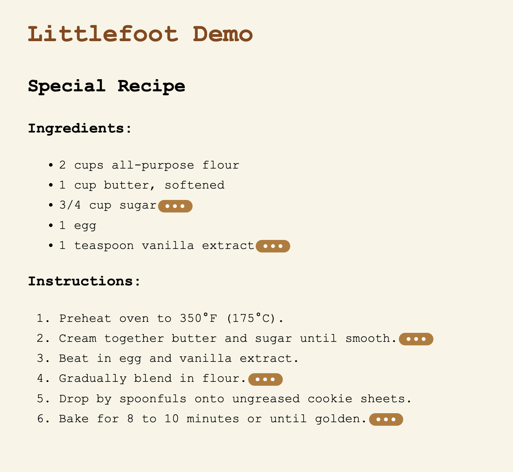
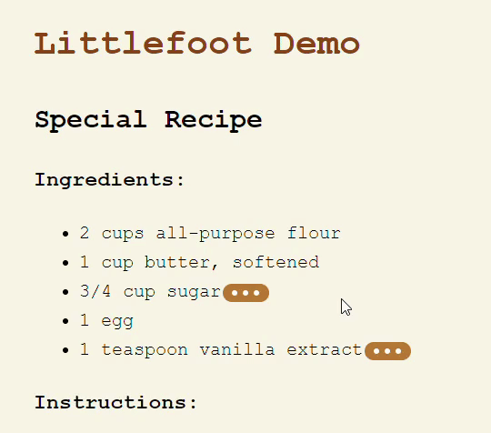
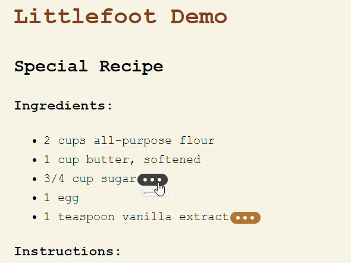

### CSE 210 F24: Group Warm-up Exercise: Fun with Footnotes

 Team 3 

 
 [[Updated Demo Repo](https://github.com/sneha-pujari/cse210_littlefoot_demo)]

# littlefoot.js Code Review

## 1. Architecture Overview
> - Overview of the major components and their interactions.
> - How the architecture supports the purpose of the package.
> - Any strengths or weaknesses identified in the design.
> - littlefoot.js is a modular, lightweight JavaScript library for enhancing footnotes with popovers.

- The architecture follows a clean separation of concerns, dividing responsibilities across DOM manipulation, event handling, and use cases.
- The core functionality is built around customizable settings, which allow users to control the activation, dismissal, and appearance of footnotes.
- Components like setup, addListeners, and useCases are well-encapsulated, promoting reusability and maintainability.

## 2. Design Decisions
> - Key patterns used (e.g., MVC, Singleton, etc.).
> - Discussion of modularity and separation of concerns.
> - How decisions align with JavaScript best practices.
> - Key Patterns: The library follows a factory-style pattern, creating an instance of littlefoot that manages footnote interactions. This pattern simplifies extensibility and customization.

- Modularity: Each responsibility, such as DOM manipulation, event handling, and settings management, is neatly divided into its own module. This ensures separation of concerns and makes the library easy to extend or modify.
- Best Practices: The code adheres to modern JavaScript/TypeScript practices, leveraging ES6+ features like destructuring and default parameters.
- The hover delay looks very odd, it pops up small, delays, and then has the expanded animation. This is not an issue without delay set to a value.
- The hover and clicking functionality are a little odd together when hover is activated. 

## 3. Code Organization and Quality
> - Code readability and maintainability.
> - Use of language features, async programming, etc.
> - How easy it is to add features or debug the system.
> - Tests: Coverage, usefulness, and ease of running.

- The code is clean, well-commented, and easy to follow. TypeScript types are effectively used to ensure type safety, making the library robust and less prone to runtime errors.
- The project uses Vitest and Cypress for testing, ensuring that both unit tests and end-to-end tests are covered. However, expanding test coverage would further improve code quality.
- Async Programming: The library doesn’t rely heavily on asynchronous code but would benefit from incorporating more thorough error handling.

## 4. Repository Organization and Quality
> - Structure of the repository and directory organization.
> - **Documentation quality** (setup instructions, comments).
> - Build tools, testing framework, and any CI/CD pipelines.
- The repository is well-structured, with clearly defined directories for src/, cypress/ tests, and build configurations.
-  Documentation: The documentation in README.md is comprehensive, covering installation, usage, and customization. Additional examples could be provided for advanced use cases.
- Build and Linting Tools: The use of Rollup for building and biome for linting ensures that the code is clean and adheres to a consistent style.
- CI/CD: There are no clear signs of continuous integration setup in the repository, which could improve the automation of tests and releases.

## 5. Tooling and Challenges
> - Setup process and any difficulties faced.
> - Tooling quality (package managers, linter, formatter).
> - Build and testing experience.

- The setup process wasn't the best. Some parts of the documentation were vague, without specific instructions on the setup. Some Developers unfamiliar with HTML/JS plugins might face a slight learning curve. 
- Tooling Quality: The use of Commitlint, Husky, and Vitest indicates a focus on maintaining code quality and enforcing commit standards.
- Challenges: The library could benefit from more detailed testing coverage, especially for edge cases involving different footnote markup structures.

## 6. Usage Decision
> - Would I use **littlefoot.js** in future projects?
> - Final recommendation on using the package.

- **Would I use littlefoot.js?** Yes, littlefoot.js is a well-designed library for enhancing footnotes. It provides flexibility, ease of use, and good modularity for customization.

## Final Recommendation
- littlefoot.js is a solid, well-designed library with minimal issues. I would recommend it for use in projects that require enhanced footnote functionality. The effort to address minor shortcomings is minimal, making it a good fit for most use cases.

---

## Improvements
[[Updated Demo Repo](https://github.com/sneha-pujari/cse210_littlefoot_demo)]

### 1. Documentation could be better
- Instead of the provided code snippets, it would be helpful to explain with full code to understand how to integrate littlefoot into the existing code.
- Expecially for the 'Options' and 'Theming' parts, it would be nice if they explain in detail of how do we can apply the change with corresponding code examples.
- 

### 2. De-highlighting Button
 Focus isn't necessary to highlight the button while it's selected because of the active/is active/hover flags. It will be highlighted when you are still hovering after clicking, but then you don't need to click other places on the document to dehighlight it. Opening the footnote is what sets the active flags to true. We set the hover delay to 0 so we don't see the animation. We shrunk the button, and changed our test file src so that it doesn't have redundancies.

<table>
  <tr>
    <td>  </td>
    <td>  </td>
   </tr> 
   <tr>
      <td>Before</td>
      <td>After</td>
  </tr>
</table>

 ### 3. Include footnote numbering within the actual footnote popup

 ### 4. CSS Changes

- Added a custom HTML file to demonstrate the footnotes functionality.
- Created CSS files for custom styling such as font, pop-up of the littlefoot footnote, hover and click opening of the footnote
