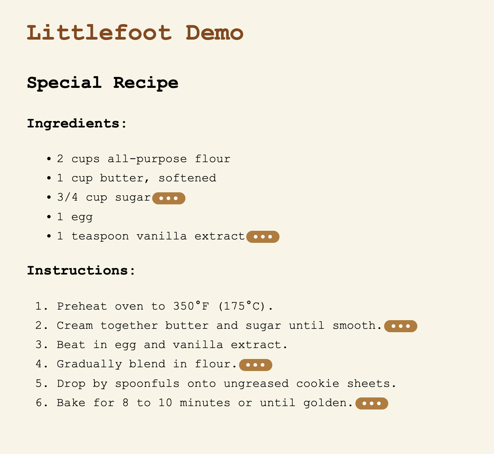
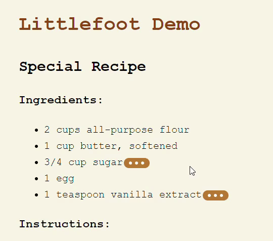
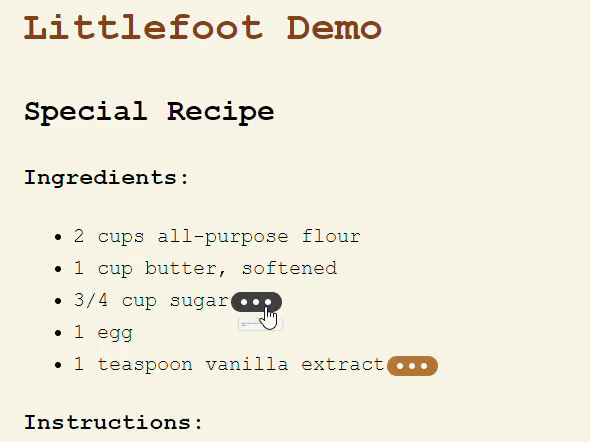
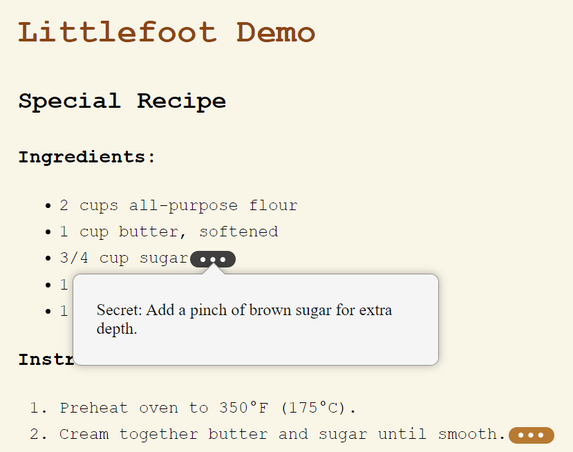
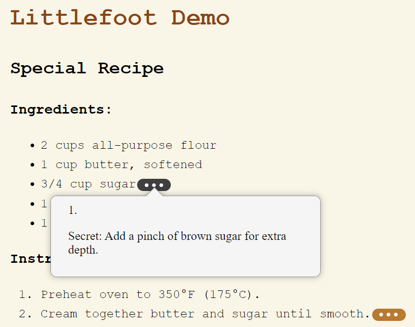

### CSE 210 F24: Group Warm-up Exercise: Fun with Footnotes
<div style="text-align: right"> Team 3 </div>
 
 [[Updated Littlefoot Repo](https://github.com/sneha-pujari/cse210_littlefoot_demo)]<br>
 [[Littlefoot Demo Deployment](https://littlefoot3.netlify.app/src/test.html)]

# littlefoot.js Code Review


## 1. Architecture Overview
Littlefoot.js is a modular, lightweight JavaScript library for enhancing footnotes with popovers.
- The architecture follows a clean separation of concerns, dividing responsibilities across DOM manipulation, event handling, and use cases.
- The core functionality is built around customizable settings, which allow users to control the activation, dismissal, and appearance of footnotes.
- Components like setup, addListeners, and useCases are well-encapsulated, promoting reusability and maintainability.
- The library relies on typescript files, which are later converted into JavaScript. This is for greater type safety than Javascript provides, but TypeScript is controlled by Microsoft and is subject to their upkeep decisions. 
- Littlefoot uses Cypress, a testing framework for webapplications. This allows real-time reloading and for the developers to run tests in the same environment as their application, but it has limited support for testing on different browsers.
- It also uses Husky as a Git hooks manager. This can enforce code quality and consistency through automated scripts, but it slows dowm commits. 

## 2. Design Decisions
Key Patterns: 
- The library follows a factory-style pattern, creating an instance of littlefoot that manages footnote interactions.
- This simplifies extensibility and customization.

Modularity: 
- Each responsibility, such as DOM manipulation, event handling, and settings management, is neatly divided into its own module.
- Ensures separation of concerns and makes the library easy to extend or modify.

Best Practices: 
- The code adheres to modern JavaScript/TypeScript practices.
- Leverages ES6+ features like destructuring and default parameters.

Design Decisions for Footnotes:
- The footnotes stay visible but static on the page when the user scrolls away.
- The footnote button remains highlighted when you click to close the footnote.

## 3. Code Organization and Quality
- The code is clean, well-commented, and easy to follow. TypeScript types are effectively used to ensure type safety, making the library robust and less prone to runtime errors.
- The project uses Vitest and Cypress for testing, ensuring that both unit tests and end-to-end tests are covered. However, expanding test coverage would further improve code quality.
- Async Programming: The library doesn’t rely heavily on asynchronous code but would benefit from incorporating more thorough error handling.


## 4. Repository Organization and Quality
- The repository is well-structured, with clearly defined directories for src/, cypress/ tests, and build configurations.
-  Documentation: The documentation in README.md is comprehensive, covering installation, usage, and customization. Additional examples could be provided for advanced use cases.
- Build and Linting Tools: The use of Rollup for building and biome for linting ensures that the code is clean and adheres to a consistent style.
- CI/CD: There are no clear signs of continuous integration setup in the repository, which could improve the automation of tests and releases.

## 5. Tooling and Challenges
- The setup process was confusing. The documentation was vague in several spots and did not really specific instructions on the setup. Instructions on creating a local instance that can be customized was lacking. Developers unfamiliar with HTML, the plugins, and TypeScript might face a slight learning curve. 
  - Instead of the provided code snippets, it would be helpful to explain with full code to understand how to integrate littlefoot into the existing code.
  - Expecially for the 'Options' and 'Theming' parts, it would be nice if they explain in detail of how do we can apply the change with corresponding code examples.
- Tooling Quality: The use of Commitlint, Husky, and Vitest indicates a focus on maintaining code quality and enforcing commit standards.
- The library could benefit from more detailed testing coverage, especially for edge cases involving different footnote markup structures.

Testing Pain Points:
- The footnote animations look very odd when hover is activated and the hover delay is set to any value above 0. The footnote will appear in shrunken form, pause, and then expand with the animation. Ideally, the footnote would not pop up at all until the delay was completed. This is not an issue with clicking open or closed the footnote.
- When hover is activated for littlefoot, trying to hover and click the button can behave strangely. 

## 6. Usage Decision
**Would I use littlefoot.js?** 
- Yes, littlefoot.js is a well-designed library for enhancing footnotes. It provides flexibility, ease of use, and good modularity for customization.


## Final Recommendation
- littlefoot.js is a solid, well-designed library with minimal issues. I would recommend it for use in projects that require enhanced footnote functionality. The effort to address minor shortcomings is minimal, making it a good fit for most use cases.

---

## Improvements
[[Updated Littlefoot Repo](https://github.com/sneha-pujari/cse210_littlefoot_demo)]<br>
 [[Littlefoot Demo Deployment](https://littlefoot3.netlify.app/src/test.html)]

### 1. De-highlighting Button
-  We changed the behavior of the footnote button when you click to close it instead of clicking elsewhere on the page. Instead of remaining highlighted, our change will make the button go back to its original, dehighlighted state. 
- We did this by removing the check in the CSS file for if a button is has the focus flag in addition to active, is-active, and hover. If any of these are set to true, the button will be highlighted. Focus, however, is not necessary to highlight the button when it's open or hovered over because of the other flags. Now, closing the footnote will immediately dehighlight the button instead of staying highlighted until you click elsewhere on the page. 

<table>
  <tr>
    <td>  </td>
    <td>  </td>
   </tr> 
   <tr>
      <td>Before</td>
      <td>After</td>
  </tr>
</table>


 ### 2. Include footnote numbering within the actual footnote popup
 - The number(order of the footnote) will now show up at the beginning of the footnote content for clarity.
 - We made this change under setting.ts in contentTempate, add  ``` <% number %> ```  Before  ``` <% content %> ``` 

<table>
  <tr>
    <td>  </td>
    <td>  </td>
   </tr> 
   <tr>
      <td>Before</td>
      <td>After</td>
  </tr>
</table>

 ### 3. CSS Changes
- Added a custom HTML file to demonstrate the footnotes functionality.
- Created CSS files for custom styling such as font, pop-up of the littlefoot footnote, hover and click opening of the footnote
- Activated hover
- Set the hover delay to 0 so we don't see the odd delay animation
- Shrunk the footnotes button
